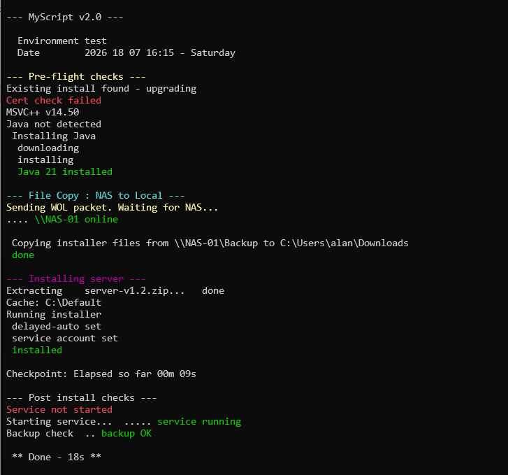
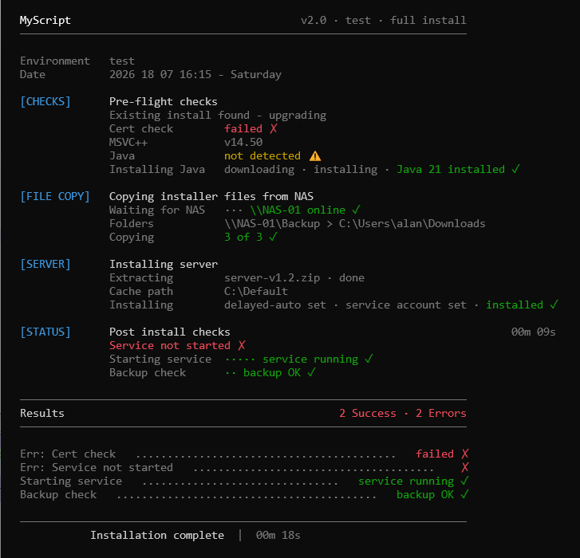

# Contents

- [What is TidyLog](#what-is-tidylog)
- [Why use TidyLog](#why-use-tidylog)
- [Quick Start](#quick-start)
  - [Demo Scripts](#demo-scripts)
- [Design Language](#design-language)
- [Requirements](#requirements)
- [Contributing](#contributing)
- [License](#license)

# What is TidyLog 

It's spacious console output for PowerShell.

Easy to use functions that provide great layout with zero config. 

v0.9.0 · PowerShell 5.1+ (Windows) · PS 7+ (Windows/macOS/Linux) · MIT · [SemVer 2.0.0](https://semver.org/spec/v2.0.0.html)

# Why use TidyLog?

Advantages over DIY layout:
- Zero manual layout needed. **No more layout coding**.
- Structured output with minimal code overhead. Close to using vanilla PS commands.
- Semantic functions describe the output. The code self documents.
- Styled helpers for loop counters, input, selection and errors.

Here's the difference:

**> _Without_ TidyLog**  : Write-Host with occasional spacing.



**> _With_ TidyLog** : The same output transformed by using space, structure and consistency. Easy to scan **quickly**.




# Quick Start

For existing code:
```powershell
# dot-source and go
. .\TidyLog.ps1

# or install from the Gallery
Install-Module TidyLog-pwsh
```

To create an example file that uses dot-source TidyLog:  
1) Download [TidyLog Demo Pack](#link) and unzip to new folder.
2) In the new folder, create a new .ps1 file and paste in this code:
```powershell
. "$PSScriptRoot\TidyLog.ps1"

# lead with a header
Write-TLHeader -Title "MyScript" -Summary "v2.0","prod","full install"

# write phases to display details of actions/events
Write-TLPhase "SERVER" "Installing Server"
    Write-TLDetail "Java"            "21.0.3"
    Write-TLDetail "Disk space"      "low"      -Icon warn
    Write-TLDetail "Server install"  "complete" -Icon ok  -ShowInSummary	

# close with a footer
Write-TLFooter -Message "Install complete"
# a results summary auto-renders above the footer if -ShowInSummary entries exist
```
3) Run your new .ps1 file in PowerShell.

## Demo Scripts

These demos are runnable examples showing how to use the TidyLog library.  

To run the demo, download [TidyLog Demo Pack](#link) and unzip to new folder. `cd` to the new folder and run the commands below.

*> Windows blocks downloaded scripts by default, so prefix the file name with 
`powershell -ep Bypass -f`.*


```powershell
# run the full demo to see how each function works
powershell -ep Bypass -f .\TidyLog-Demo.ps1

# filter to a specific functional section
powershell -ep Bypass -f .\TidyLog-Demo.ps1 -Phase PROGRESS
# skip the timed/slower demo sections
powershell -ep Bypass -f .\TidyLog-Demo.ps1 -NoWait -NoCounters -NoInput

# run the before/after comparison
powershell -ep Bypass -f .\TidyLog-With.ps1      # with TidyLog
powershell -ep Bypass -f .\TidyLog-Without.ps1   # without TidyLog

# launch before/after side by side in Windows Terminal
# NOTE: This launcher is Windows only
powershell -ep Bypass -f .\TidyLog-WinLaunch.ps1
```

# Requirements

- PowerShell 5.1 or later
- Dark terminal background. TidyLog's color palette is optimised for dark themes. Windows Terminal, VSCode integrated terminal with a dark theme, and most modern PS setups work correctly out of the box. For light backgrounds use `Set-TLGlyphSet -CharSet ASCII` as a partial workaround. A full light theme variant is possible if there is demand.
- Works best on console of 80+ chars width.
- Unicode support for full glyph rendering. Use `Set-TLGlyphSet -CharSet ASCII` for older consoles or PS 2+ environments.
- Designed for interactive console sessions. Functions that read the console window (Write-TLPhase -ShowElapsed) or use console rewrite (e.g. Write-TLCounter's in-place rewrite) assume a live terminal is attached. Output redirected to a file, scheduled tasks, CI/CD runners, or some remote sessions may not expose these properties reliably. Start-Transcript does not faithfully reproduce the console output.

---

# Design Language

**TidyLog is opinionated**. It makes considered decisions so you can dedicate thought to script logic, not layout. Sensible defaults, consistent colors and clean layout ready to go.

**Less is more, but only when less is genuinely enough.** Every element earns its place.

**Consistency.** Grid, columns, alignment, sections and colors.

**Prefer space over decoration.** Space communicates when decoration cannot.

**The library feels natural.** Every function is an imperative statement that immediately gets something done. They allow you to focus on the task instead of thinking about the tool.

# Links

https://github.com/tidy-tools/tidylog-pwsh  
https://tidylog.dev

# Name and usage
"TidyLog" refers to this design system and its implementations maintained under the tidy-tools GitHub organisation. 
Other projects in other ecosystems happen to share the name (there are tidylog packages in R and Python that are unrelated). If you build something in the TidyLog design tradition, let me know. If you build something quite different, then giving it a different name reduces confusion for everyone.

# Contributing
Bug reports are welcome via Issues, which are reviewed periodically with no response SLA. Feature ideas are welcomed by email at feedback@tidylog.dev. TidyLog is a curated project and not all suggestions will be adopted.
Check the vNext backlog for planned features.
Full contribution policy: CONTRIBUTING.md

# License

MIT License : Copyright 2026 Nathan Kitchen


